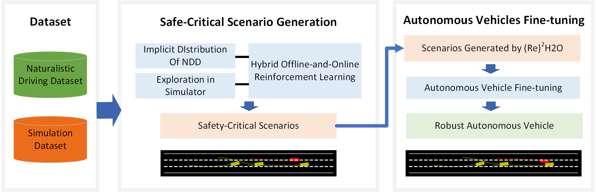

# (Re)<sup>2</sup>H2O

(Re)<sup>2</sup>H2O ([https://arxiv.org/abs/2302.13726](https://arxiv.org/abs/2302.13726)) is a approach that combines offline real-world data and online simulation data to generate diverse and challenging scenarios for testing autonomous vehicles (AVs). Via  a **Re**versely **Re**gularized **H**ybrid **O**ffline-and-**O**nline Reinforcement Learning framework,  (Re)<sup>2</sup>H2O penalizes Q-values on real-world data and rewards Q-values on simulated data to ensure the generated scenarios are both varied and adversarial. Extensive experiments have shown that this (Re)<sup>2</sup>H2O is capable of generating riskier scenarios compared to competitive baselines and can generalize its applicability to various autonomous driving models. Additionally, these generated scenarios are proven to be effective for fine-tuning the performance of AVs.



## 1. Installation and Setups

To install the dependencies, run the command:

```python
pip install -r requirements.txt
```

Add this repo directory to your `PYTHONPATH` environment variable:

```
export PYTHONPATH="$PYTHONPATH:$(pwd)"
```

Also, `sumo` is needed in this project.


## 2. Dataset Processing

Traffic dataset needs to be downloaded from the [highD dataset](https://levelxdata.com/highd-dataset/). Afterward, the dataset should be processed following the steps below:

1. Split the highD dataset into traffic flow data containing a specific number of vehicles, while `rootpath` is the path of highD dataset, `num_agents` number of vehicles in the traffic flow, `dis_threshold` is maximum distance threshold between vehicles in the initial state:

   ```python
   python dataset/highD_cut.py rootpath=./highD-dataset num_agents=2 dis_threshold=15
   ```

2. Process the obtained traffic flow data into a dataset suitable for reinforcement learning algorithms:

   ```python
   python dataset/dataset.py rootpath_highd="./highD-dataset/data/" rootpath_cut="./highD-dataset/highd_cut/
   ```

   

## 3. Run Experiments

### Adversarial Training:

To train the adv-agents via (Re)<sup>2</sup>H2O, run:

```python
python main.py --ego_policy="-sumo" --adv_policy="-RL" --n_epochs_ego=0 --n_epochs_ego=1000 --num_agents=2 --realdata_path="../dataset/r3_dis_20_car_3/" --is_save=False
```

Number of adv-agents is set through the parameter `num_agents`, and parameter `realdata_path` needs to match `num_agents`. If you want to save the scenarios generated during training and save the trained model, set `is_save==True`.

To train policy of adv-agents, `adv_policy` should be set to `"-RL"`, while `ego_policy` can be set to an any specific policy.

### Autonomous Driving Training:

Also, if you  want to train the ego-agents, we provide an algorithm based on SAC (Soft Actor-Critic). Run:

```python
python main.py --ego_policy="RL" --adv_policy="sumo" --n_epochs_ego=500 --n_epochs_ego=0 --num_agents=2 --realdata_path="../dataset/r3_dis_20_car_3/" --is_save=False
```

### Interactive Training:

To evaluate training effectiveness and further enhance model performance, a process for interactive training between ego-agents and adv-agents has been designed. Here is a running example:

```python
python main.py --ego_policy="RL-sumo-RL" --adv_policy="sumo-RL-sumo" --n_epochs_ego=500-500 --n_epochs_ego=1000 --num_agents=2 --realdata_path="../dataset/r3_dis_20_car_3/" --is_save=False
```


## 4. Visualization

To obtain the learning curves, you can resort to [wandb](https://wandb.ai/site) to login your personal account with your wandb API key.

```
export WANDB_API_KEY=YOUR_WANDB_API_KEY
```

and set parameter `use_wandb=True` to turn on the online syncronization.

Also, generated scenarios can be visualized by functions in file `utils/scenarios_reappear.py`.


## 5. Citation

If you are using (Re)<sup>2</sup>H2O framework or code for your project development, please cite the following paper:

```
@misc{niu2023re2h2o,
      title={(Re)$^2$H2O: Autonomous Driving Scenario Generation via Reversely Regularized Hybrid Offline-and-Online Reinforcement Learning}, 
      author={Haoyi Niu and Kun Ren and Yizhou Xu and Ziyuan Yang and Yichen Lin and Yi Zhang and Jianming Hu},
      year={2023},
      eprint={2302.13726},
      archivePrefix={arXiv},
      primaryClass={cs.LG}
}
```

